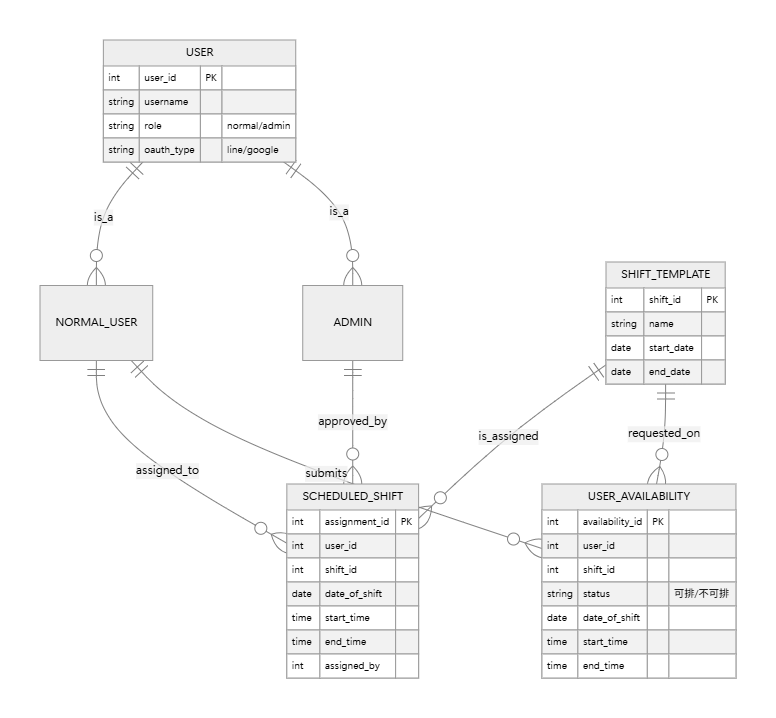

# 專案計劃
## 專案名稱
* WEB-04-01 互動式動態網頁（後端）
## 專案內容
* 專案方向
製作一個排班網站。
* 主要專案內容:
    1. 使用者功能：
        * 使用者登入與登出功能，包含 OAuth 註冊與登入
        * 日期排班功能(選擇可上班日期)
        * 歷史查詢
        * 班表查詢
    2. 後台管理功能
        * 使用者管理
        * 新增可排班日期區間(可限制可排班日期)
        * 排班功能(依照相關限制排班，ex: 勞基法...)(額外: 分初版、再版...等)
    3. 部署專案至任一雲端服務
* 預期使用技術:
    * Backend：
        1. Express: 後端框架，version: 5.1.0
        2. Passport: 帳號權限管理/登入登出/加密 + JWT + Oauth 串接
        3. sequelize: 資料庫（ORM）
        4. node-redis: 資料庫（Redis）
        5. AdminBro: 簡易前端畫面 (額外)
    * DataBase：PostgreSQL
    * Deploy：
        1. AWS: 雲端部屬
        2. testing: github CI/CD + mock (單元測試、TDD/BDD)
    * Document: swagger
* 預期成果
    1. 開發出符合業界標準、RESTful API 的後端網站架構。
    2. 掌握如何整合 Express 與相關套件
    3. 可通過 CI/CD 測試。
    4. 能部署專案至雲服務

## 資料庫規劃

## 時程規劃
1. 基礎準備（第1-2週）
    * 目標：建立開發環境，能寫出簡單 API 並操作資料庫。
    1. 第 1 週｜環境建置與 Express 入門 + 資料庫串接
        * 熟悉 Express 架構與路由設計
        * 建立基本 API server (express) 
        * 初步認識 RESTful API 設計風格
        * 建置 PostgreSQL (docker)
        * 使用 ORM（sequelize）
        * 確定 API 規格(與 swagger 一同處理)與基本資料庫結構（使用者、班表...等）
    2. 第 2 週｜使用者系統 
        * 使用者資料 CRUD API
        * JWT 登入/註冊與 middleware 權限驗證 功能
        * 密碼加密（bcrypt）、Token 驗證
        * 權限管理
        * OAuth（passport.js策略: passport-line or passport-google-oauth20 or passport-instagram...等）
 
2. 核心功能建置（後端邏輯）（第3-4週）
    * 目標：完成一般使用者、管理者功能 API。
    1. 第 3 週｜一般使用者 
        * 日期排班功能(選擇可上班日期)
        * 歷史查詢
        * 班表查詢
    2. 第 4 週｜管理者功能
        * 使用者管理
        * 新增可排班日期區間(可限制可排班日期)
        * 排班功能(依照相關限制排班)

3. 雲端部署 + 最終優化（第5-6週）
    * 目標：雲端部署
    1. 第 5 週｜雲端部署 
        * 將專案部署至 AWS
        * 部署資料庫 PostgreSQL
    2. 第 6 週｜ 測試API 文件、簡報與發表 
        * 撰寫單元測試與 API 測試（Jest）
        * CI/CD：串 GitHub Actions 自動跑測試 / 部署
4. 成果展示 (第7週)
    * 目標: 成果展示
    1. 第 7 週｜成果展示
        *  報告撰寫
        *  成果展示
